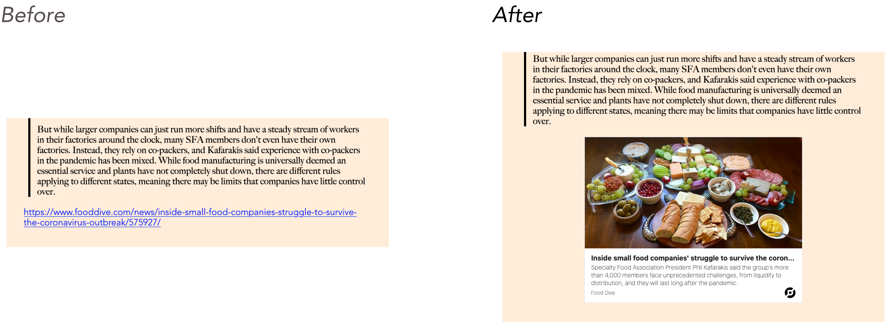

# Gatsby Remark Links Unfurl

_Disclaimer: This is a fork of [gatsby-remark-link-unfurl](https://github.com/hgezim/gatsby-remark-link-unfurl) by [hgezim](https://github.com/hgezim)_

Show Link Previews In Your Markdown with Gatsby Remark Unfurl



## Motivation

I wanted to preview links similarly to how Notion's bookmark or Slack's previews embeds previews of the links' destinations.

I've always admired how good links look in Slack. Instead of showing you a measly underlined blue link, Slack show you this:

Slack "Preview" Example:


Notion "Bookmark" Example:


## Usage

### Install Gatsby Remark Link Unfurl

1. `npm install --save gatsby-remark-link-unfurl`

   Note: This requires `gatsby-transformer-remark`.

**Important**: `processedUrlsFile` is the JSON file that will store previously processed urls. This file will be created if it doesn't exist. If it exists, it should be a valid JSON file. You should commit this to your repository.

#### With Gatsby Transformer Remark

```js
// In your gatsby-config.js
plugins: [
  {
    resolve: `gatsby-transformer-remark`,
    options: {
      plugins: [{
            resolve: `gatsby-remark-link-unfurl`,
            options: {
              processedUrlsFile: `${__dirname}/link-cache/cache.json`,
            },
          }],
    },
  },
],
```

### Your Markdown Post

We only transform links if they're on their own line:

```md
# Your awesome blog title

Your amazing thoughts.

And finally a link:

https://www.commerceowl.com/resources/news-and-updates/customize-your-recipe-page
```

## Styling

I did not want to inline the styles and cause bloat.
You can style as you wish but the default styles are below.

These are shamelessly copied from [microlink](https://microlink.io/docs/sdk/integrations/react).

```css
a.gatsby-remark-link-unfurl__container {
  margin: 0 auto;
  font-size: 21px;
  line-height: 24px;
  font-weight: lighter;
  max-width: 500px;
  background-color: #fff;
  border-width: 1px;
  border-style: solid;
  border-color: #e1e8ed;
  overflow: hidden;
  color: #181919;
  font-family: InterUI, -apple-system, BlinkMacSystemFont, 'Helvetica Neue', 'Segoe UI', Oxygen, Ubuntu,
    Cantarell, 'Open Sans', sans-serif;
  display: flex;
  text-decoration: none;
  opacity: 1;
  position: relative;
  transition-duration: 150ms;
  transition-timing-function: cubic-bezier(0.25, 0.8, 0.25, 1);
  transition-property: background, border-color;
  will-change: background, border-color;
  flex-direction: column;
  height: 382px;
}

a.gatsby-remark-link-unfurl__container:hover {
  background: #f5f8fa;
  border-color: rgba(136, 153, 166, 0.5);
  outline: 0;
}

.gatsby-remark-link-unfurl__media {
  flex-shrink: 1;
  flex-grow: 1;
  flex-basis: 0%;
  background: transparent no-repeat center center / cover;
  display: block;
  overflow: hidden;
  height: auto;
}

.gatsby-remark-link-unfurl__content {
  display: flex;
  padding: 10px 15px;
  min-width: 0;
  box-sizing: border-box;
  flex: 0 0 125px;
  justify-content: space-around;
  flex-direction: column;
  align-items: stretch;
}

.gatsby-remark-link-unfurl__title {
  text-align: left;
  font-weight: bold;
  margin: 0;
  width: 100%;
  flex-grow: 1.2;
  font-size: 16px;
}

.gatsby-remark-link-unfurl__title p {
  margin: 0;
  overflow: hidden;
  white-space: nowrap;
  text-overflow: ellipsis;
}

.gatsby-remark-link-unfurl__description {
  text-align: left;
  font-size: 14px;
  flex-grow: 2;
  margin: auto 0;
  line-height: 18px;
}

.gatsby-remark-link-unfurl__description p {
  margin: 0;
}

.gatsby-remark-link-unfurl__container footer {
  display: flex;
  align-items: center;
  justify-content: space-between;
  text-align: left;
  margin: 0;
  flex-grow: 0;
  font-size: 12px;
  width: 100%;
}

.gatsby-remark-link-unfurl__container footer p {
  overflow: hidden;
  white-space: nowrap;
  text-overflow: ellipsis;
  margin-top: 0;
}

.gatsby-remark-link-unfurl__container footer span {
  min-width: 16px;
  width: 25px;
  height: 25px;
  background-size: contain;
}
```

## Inspiration

- [Gatsby Remark Oembed Plugin](https://github.com/raae/gatsby-remark-oembed)
- [Microlink](https://microlink.io/docs/sdk/integrations/react)
- [Unfurl](https://github.com/jacktuck/unfurl/)
- [gatsby-remark-link-unfurl](https://github.com/hgezim/gatsby-remark-link-unfurl)
